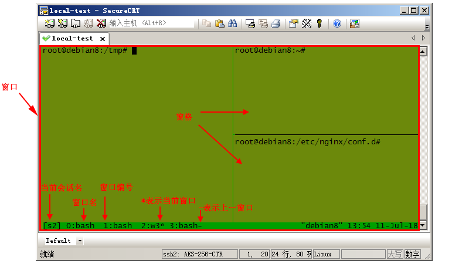

# 在一切之前...
**需要使用服务器的同学请通过微信私信你们的账号和密码，默认是没有的。**

**管理员用户的账号密码我会发布在群中。**

# 基本使用
-   统一使用SSH协议登录，使用FRP进行地址映射，[这里是FRP的GitHub页面](https://github.com/fatedier/frp)。<br>

    所以每次开关机需要重新启动 FRP。所以大家开关机前**请联系我**。
    
-  当前目录切换：`cd 目录名`

   查看 GPU 利用情况：`nvidia-smi`

   查看所有用户对于 CPU 的使用情况：`htop`
   
   查看硬盘信息：`df -h`
   
   退出：`exit`

-  机械硬盘挂载点在`/mnt/devices` 中，为了节省本来就不多的固态硬盘资源，
   
   所有同学和老师的用户在建立完成以后家目录都默认在 `/home/用户名` 中 

   初次登陆大家的家目录下的软连接 `Datas` 就是指向机械硬盘挂载点下的文件夹的 
   
   软连接如下：`Datas -> /mnt/devices/datas/用户名`

   请大家尽量将所需要的数据集、代码拷贝至此软连接文件夹中，固态硬盘空间有限，还请大家支持！

-  如果需要安装软件可以登录管理员用户安装，或者联系服务器维护的同学。

# Python & Anaconda 指令
-  使用GPU进行运算，请添加这些到源代码中：
    ```
    import os
    os.environ['CUDA_VISIBLE_DEVICES'] = ‘0’
    ```

-  动态分配显存，请添加这些到源代码中：**（这个在程序之中必须加上）**
    ```
    config = tensorflow.ConfigProto()
    config.gpu_options.allow_growth = True
    session = tensorflow.Session(config=config)
    ```

-  Anadonda 虚拟环境，在命令行下执行
    ```
    conda create --name 环境名 python=需要的python 版本          # 创建环境
    source activate 环境名                                      # 激活环境
    source deactivate 环境名                                    # 退出环境
    conda remove --name 环境名 --all                            # 删除环境
    ```

    请在虚拟环境中配置实验需要的组件、资源版本，具体的大家可以上网参考。

    例如我的实验环境配置（仅供参考）:
    ```
    conda create –-name myEnvironment python=3.6

    source activate myEnvironment
    # 之后可以发现终端最前方出现了括号，括号内是你设置的环境名

    pip3 install keras=1.2.0
    # 安装实验所需的 1.2.0 版本的 keras

    # 之后开始实验，实验完成后……
    source deactivate myEnvironment

    # 如果不再使用了，就删除这个虚拟环境释放硬盘空间
    conda remove --name myEnvironment –all
    ```

-  更换终端后的环境变量设置（如果看不懂或者不知道啥意思的同学们可以跳过这一步）

    同学可能会更换自己喜欢的终端（比如我就换了`zsh`），更换完后可能发现conda无法使用，因为conda的环境变量默认是添加在`bash`终端的配置文件`.bashrc`中的，所以需要将相应终端的环境变量配置好，我就以`zsh`为例子为大家演示一下
    ```
    echo 'export PATH="/opt/anaconda3/bin:$PATH"' >> ~/.zshrc && source ~/.zshrc
    ```
    复制此行代码粘贴到终端执行即可。

# Tmux

鉴于实验室网络环境很差，大家在家对实验室在改代码、跑实验的时候网络总是断网。当SSH会话中断的时候，一切会话都会强制中断。

很烦....

所以我建议大家在跑实验的时候使用TMUX。

## 什么是TMUX

TMUX（terminal multiplexer）是Linux上的终端复用神器，可从一个屏幕上管理多个终端（准确说是伪终端）。使用该工具，用户可以连接或断开会话，而保持终端在后台运行。类似的工具还有screen，个人对这二者的使用感受是，用过tmux就再也不想用screen了。

### 基本命令

```Shell
tmux new
# 创建默认名称的会话（在tmux命令模式使用new命令可实现同样的功能，其他命令同理，后文不再列出tmux终端命令）

tmux new -s mysession　　
# 创建名为mysession的会话

tmux ls　　
# 显示会话列表

tmux a　　
# 连接上一个会话

tmux a -t mysession　　
# 连接指定会话

tmux rename -t s1 s2　　
# 重命名会话s1为s2

tmux kill-session　　
# 关闭上次打开的会话

tmux kill-session -t s1　　
# 关闭会话s1

tmux kill-session -a -t s1　　
# 关闭除s1外的所有会话

tmux kill-server　　
# 关闭所有会话
```

## 其中常用快捷键

一般使用命令和快捷键进行操作，可在系统shell终端和tmux命令模式（类似vim的命令模式）下使用命令，或者在tmux终端使用快捷键。

tmux默认的快捷键前缀是Ctrl+b(下文用 `prefix` 指代)，按下前缀组合键后松开，再按下命令键进行快捷操作

另外，TMUX有窗口和窗格的概念，示意图如下



常用快捷键 **(我只列出了比较重要的如果大家有别的需要可以上网搜索一下)**：

```shell

prefix %　　                    # 水平方向创建窗格

prefix "　　                    # 垂直方向创建窗格

prefix Up|Down|Left|Right　　   # 根据箭头方向切换窗格

prefix &　　                    # 关闭当前窗口

prefix D                        # 把窗口放在后台

prefix c　　                    # 创建一个新窗口

prefix ,　　                    # 重命名当前窗口

prefix w　　                    # 列出所有窗口，可进行切换

prefix n　　                    # 进入下一个窗口

prefix p　　                    # 进入上一个窗口

prefix 0~9　　                  # 选择编号0~9对应的窗口

prefix '　　                    # 切换至指定编号（可大于9）的窗口
```